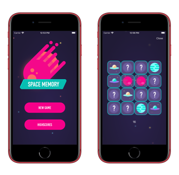
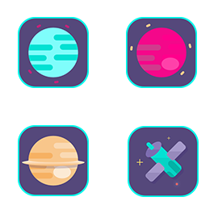

# Sample-Mobile-Space-Memory

## Challenge

***Create a memory game app for iOS or Android.***

## Game info

After starting the app, the player should be able to start a new game or view the high scores of past games on a title screen.

If the player wants to start a new game, he should be able to choose a difficulty level before the game starts. 
Optionally he can assign a player name for the highscore ladder.

The selected difficulty level determines how many fields are displayed in the game.

e.g.
| Difficult | Fieldsize |
|-----------|-----------|
| Easy      | 3 x 3     |               
| Medium    | 4 x 4     |
| Hard      | 5 x 5     |

## Highscore

The required time and the number of failed attempts is the base for calculating the achieved high score.
How the calculation looks, is not firmly defined.

## Design

The images from the `/Design` folder can be used for the basic design.

## Code

The example shown here is only an **early stage** of development as a Xamarin app and uses Apple's Game Center as a highscore service. 

It is recommended to use a cross-platform RestAPI for highscores.

## Architecture

An [MVVM](https://en.wikipedia.org/wiki/Model–view–viewmodel) architecture is recommended and the app should also be built as a cross-platform app using [Xamarin](https://visualstudio.microsoft.com/xamarin/).

A documentation for this framework can be found here: https://docs.microsoft.com/xamarin/

